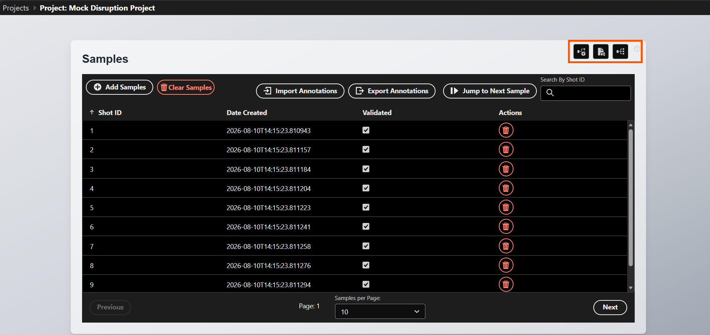
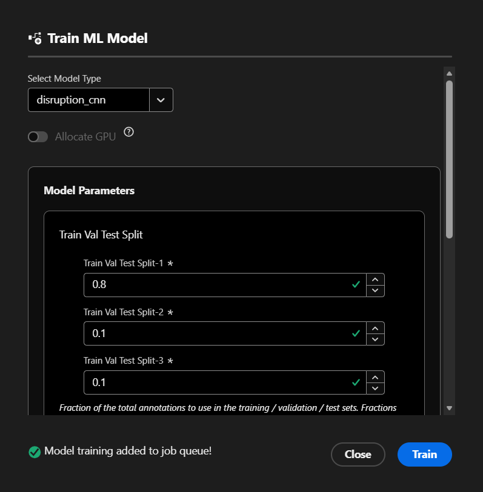
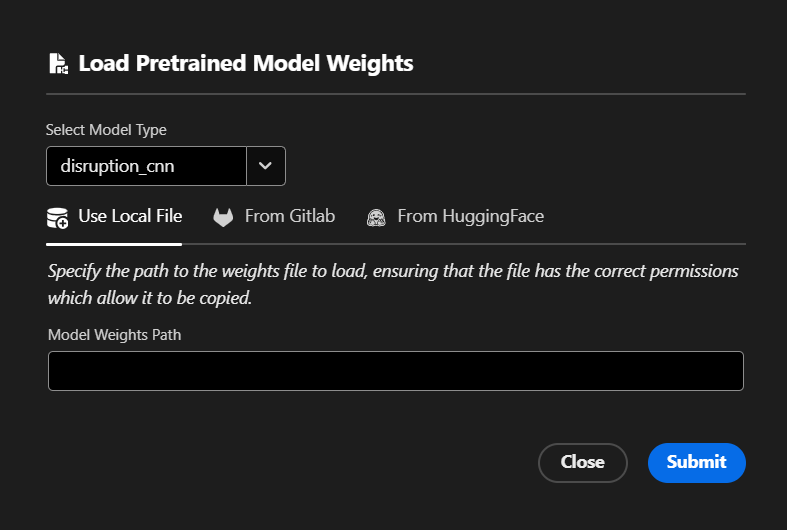
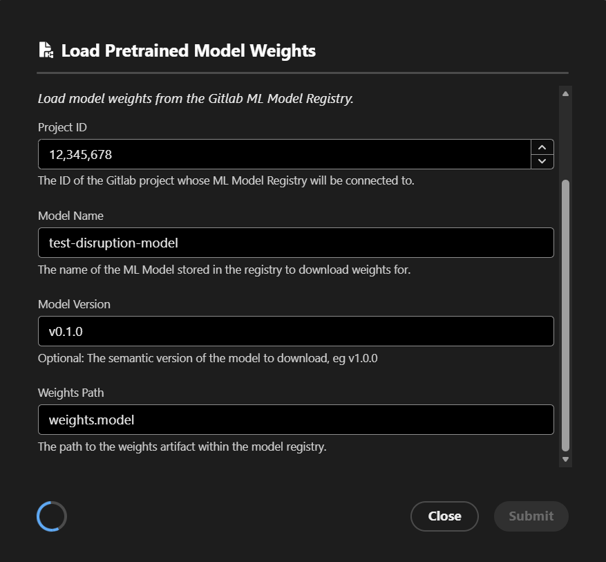
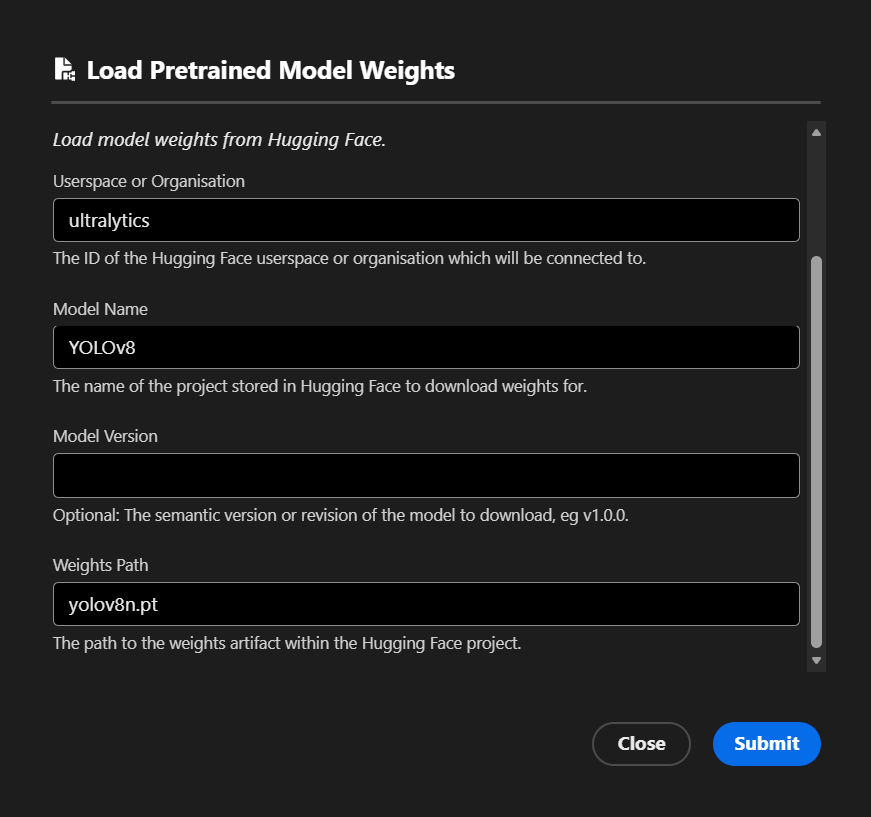
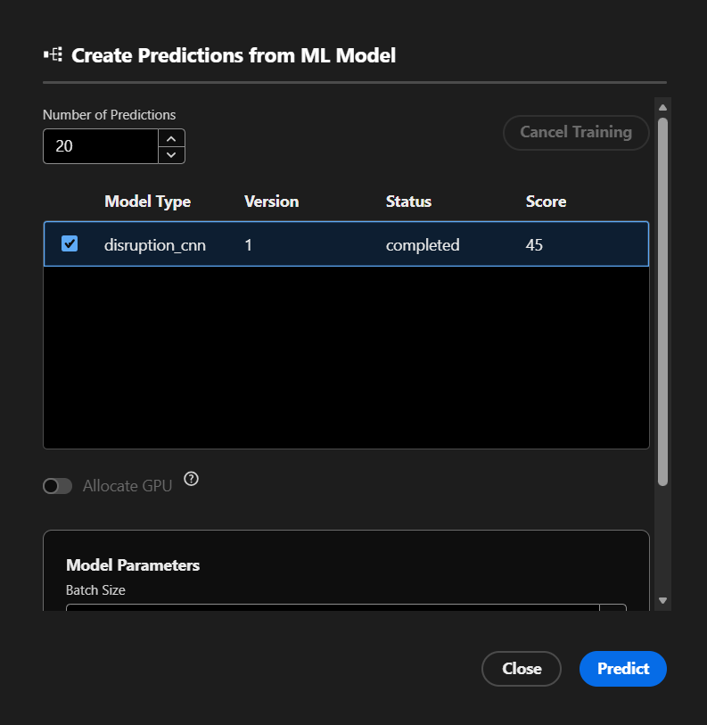
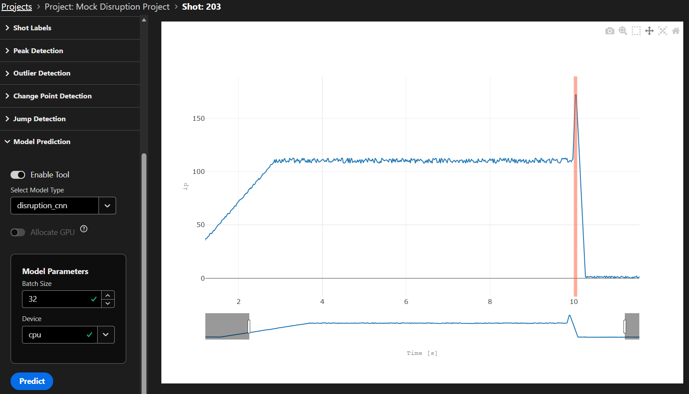

# ML Models
Machine Learning (ML) models can be trained on your labelled data, and used to predict annotations for unseen data, from within the UI. If you have a set of pretrained weights which you would like to use to generate predictions, these can be loaded in via the UI either from a local file on your machine, a Hugging Face repository, or from the Gitlab ML Model registry. A series of generic models are defined which you can use, or you can [define your own.](./custom_models.md)

!!! tip
    Note that you will need to install extra dependencies into your environment to enable the ML Models functionality:
    ```
    pip install toktagger[models]
    ```


## User Interface
To begin using ML models within TokTagger, open a project which has some annotated samples, and access the model functionality using the Train, Load and Predict buttons in the top right.

<figure markdown="span">
   { width="800" }
  <figcaption>Access the ML Model UI from within a project.</figcaption>
</figure>

### Training
To train a model, click the left button. This should open up a new window which asks you to select one of the available model types for that project, and (optionally) a form to provide some input parameters to the model. If a GPU is available on the machine, you can also specify whether to allocate a GPU to this training job. Note that non-Nvidia GPUs may not be detected automatically - [see details here for how to override this behaviour with configuration options.](./custom_models.md#gpu-usage)

<figure markdown="span">
   { width="500" }
</figure>

When you have filled out these parameters, press `Train` in the bottom right. This will add the training job to a queue, which will be picked up by a worker node when available. You can view the current status & progress of your job from the Model Predict UI window, described below.

### Load Pretrained Weights
To load existing weights into a model, select the middle button. This will again ask you to specify the model type which you wish to load your weights into, and will give you the following options of where to load from.

When pressing `Submit`, the load task will be added to the job queue, and executed when a worker node is available. The window will get updates from the server and show success / failure messages within the load UI if kept open, however it can also be safely closed and the job will be executed in the background. See the status of the loaded model from within the model predict window.

Note that since some weights files are saved using `pickle`, they may contain malware when deserialized by the TokTagger models, so be cautious if loading files which do not come from trusted authors. For added security, you can choose to enable/disable each of the following methods via the `toktagger.toml` configuration file, as well as enabling the `load_safetensors_only` option to only allow files which conform to the [SafeTensors standard](https://huggingface.co/docs/safetensors/index) to be loaded (which avoids any pickling/depickling of files).

#### Local File
For loading from a local file on your machine, simply specify the path to the existing file on your computer. Note that this will only work if the worker nodes are also running on your local system (which they are by default). 

!!! warning
    This option will not work if hosting a production TokTagger server, since users uploading files from their computers directly to the server is not supported for security reasons. You can disable this loading method by specifying `local_load_enabled = true` in the `models` section of your `toktagger.toml` file, or by setting `MODELS_LOCAL_LOAD_ENABLED=false`.

<figure markdown="span">
   { width="500" }
</figure>

This method will attempt to load the file into the model selected, and if successful, will save the weights into the toktagger model cache for future reuse.

#### Load from Gitlab
You can use a Gitlab project with the [ML Model Registry](https://docs.gitlab.com/user/project/ml/model_registry/) enabled to load weights into TokTagger. 

!!! note
    Due to limitations with Gitlab's MlFlow integration, loading weights from Gitlab is only available from servers running Gitlab v18.11 or later.

<figure markdown="span">
   { width="500" }
</figure>

To use this, make sure you have a weights file uploaded to the model registry, and then provide the following information to TokTagger:

1. Create a Personal Access Token (PAT) im Gitlab by going to your user settings > Access > Personal Access Tokens, and creating a token with at least read access to all items under the `Project Model Registry and Experiments` heading
2. Provide the URL to your Gitlab instance as `gitlab_url`, and the PAT token as    `gitlab_token` within the `toktagger.toml` config file
3. Start TokTagger, and open the loading UI
4. Select the model type to load from the dropdown
5. Enter the Gitlab project ID to load from (which can be found from Gitlab by going to the general settings of the repository)
6. Enter the name of the model in the Gitlab registry to access (which can be found in the Gitlab UI from the Deploy -> Model Registry section)
7. Optionally provide the semantic version of the model to get, eg `1.0.0`, or leave blank to get the latest version
8. Provide the path to the artifact stored within the model registry

!!! note
    If hosting a production instance of TokTagger, this will allow users to load weights from the internet into TokTagger, which may present security issues. For added security, you can limit weights files to use SafeTensors with the `load_safetensors_only` config option, or scope loading to a specific trusted Gitlab project using the `gitlab_project_id` config option. To disable loading from Gitlab, set the `gitlab_load_enabled` config option to false.

#### Load from Hugging Face
You can also load a weights file from a [Hugging Face repository](https://huggingface.co/) into TokTagger.

<figure markdown="span">
   { width="500" }
</figure>

To use this, provide the following information to TokTagger:

1. The Hugging Face userspace or organisation where your model weights are stored
2. The name of the model to download weights for
3. The semantic version of the model to download. Optional, by default gets the latest version
4. The path to the weights file within the Hugging Face repository to load

!!! note
    If hosting a production instance of TokTagger, this will allow users to load weights from the internet into TokTagger, which may present security issues. For added security, you can limit weights files to use SafeTensors with the `load_safetensors_only` config option, or scope loading to a specific trusted Hugging Face organisation or userspace using the `huggingface_userspace` config option. To disable loading from Hugging Face, set the `huggingface_load_enabled` config option to false.

### Predict
Once a model has been trained, or pretrained weights have been loaded in, you can use it to make predictions on unseen samples within the UI.

#### Multiple Samples
To make predictions on multiple samples at once, open the Predict modal with the button on the right. Here you can see each of the models which have been trained for your project, their current status, and their accuracy score (if training has completed). 

<figure markdown="span">
   { width="500" }
</figure>

To make predictions on unseen samples, select one of your models from the table, and select a number of samples to make predictions on using the input field at the top. You may then need to fill in some model prediction parameters, and can choose whether to allocate a GPU for this job if available on your machine. You can also cancel a queued or in progress train or load job by selecting it in the table, and pressing 'Cancel Training' in the top right.

Once you have filled out these parameters and pressed Predict, the job will be added to the queue and executed when a worker is available. To view the newly made annotations once available, you can use the Uncertainty query strategy and press 'Jump to Next Sample' in the project screen to view the sample with the most uncertain predictions.

#### Individual Samples
You can also make predictions on specific samples from within the sample view page. Open any sample, and find the `Model Prediction` tab in the toolbar on the left. Enable the tool using the toggle, and select a model type from the dropdown list. You can then select whether to use a GPU and fill out the model's parameters as described above. This tool will use the latest successfully trained or loaded model of the selected type to generate predictions on the current sample. Disabling the tool will remove any non-saved annotations generated by this model type from the plot.

<figure markdown="span">
   { width="800" }
</figure>