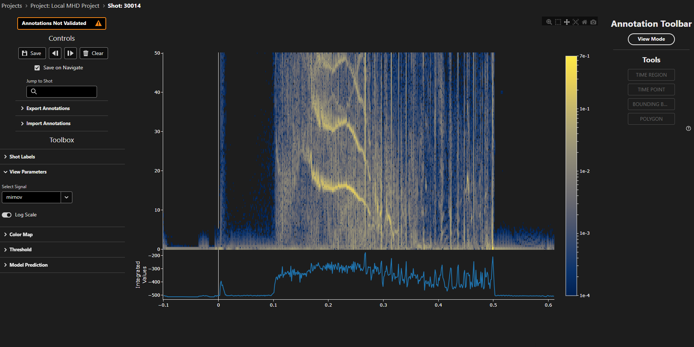

# 2D Profile Labelling Interface

The 2D profile labelling interface is designed for interactive annotation and analysis of two-dimensional tokamak diagnostic data, such as spectrograms, time-frequency representations, or other spatiotemporal measurements. This interface enables you to visualize 2D data as heatmaps, create various types of annotations, and analyze patterns across time and spatial dimensions.

## Overview

<figure markdown="span">
   
  <figcaption>The 2D profile labelling interface showing heatmap and integrated plots with annotations.</figcaption>
</figure>

The 2D profile view displays diagnostic data as a heatmap with time on the horizontal axis and a spatial dimension (e.g., frequency, radius, or position) on the vertical axis. An integrated time series plot below the heatmap shows the sum of values across the spatial dimension, helping identify temporal patterns and events.

## Interface Components

### Plot Area

The main visualization consists of two vertically stacked plots:

- **Heatmap Plot (Top)**: Displays the 2D data with color intensity representing signal amplitude or power. The color scale automatically adjusts based on the data range and can be toggled between linear and logarithmic scaling.
- **Integrated Plot (Bottom)**: Shows the time-integrated values, summed over the spatial dimension. This 1D plot helps identify significant temporal events that may be less obvious in the 2D view.

Both plots share a common time axis, enabling synchronized navigation and analysis.

### Color Scale

The heatmap uses a continuous color scale to represent data values. The colorbar on the left side shows the mapping between colors and values:

- **Linear Scale**: Direct mapping of data values to colors
- **Logarithmic Scale**: Useful for data spanning multiple orders of magnitude, with enhanced visibility of low-amplitude features

**Available Colormaps:**

- Cividis (default)
- Viridis
- Plasma
- Inferno
- Magma
- Cividis

### View Parameters

Access view parameters from the toolbar on the left:

- **Signal Selection**: Choose which diagnostic signal to display when multiple signals are available
- **Log Scale Toggle**: Switch between linear and logarithmic color scaling for better visualization of different dynamic ranges

### Navigation Controls

At the top of the interface, you'll find navigation controls to move through your dataset:

- **Previous Button** (◄): Navigate to the previous sample in your project
- **Next Button** (►): Navigate to the next sample in your project  
- **Save Button**: Save your current annotations. A project is collaborative, so the save applies your edits to the annotations of other users, and it also removes the annotations of other users that you deleted
- **Clear Button**: Remove the annotations for this sample, and mark the annotations in the database as not validated. If **Show Others' Annotations** is selected, the button removes all annotations, including the annotations of other users. If it is not selected, the button removes only your own annotations
- **Save On Navigate**: Whether to automatically save any annotations to the database when you move to a different sample
- **Show Others' Annotations**: Whether to show the annotations that other users made. TokTagger keeps this setting for each project
- **Jump to Shot**: Jump to a sample with a given shot ID

**Keyboard Shortcuts:**

- `Shift & ←`: Navigate to previous sample
- `Shift & →`: Navigate to next sample

### Plot Toolbar

The Plotly toolbar at the top of the plot provides navigation tools:

- **Zoom**: Box zoom to a region of interest
- **Box Select**: Click and drag to select multiple annotations within a region
- **Pan**: Click and drag to pan the view (the default drag mode)
- **Auto Scale**: Reset axes to show all data
- **Reset View**: Return to the initial view
- **Download Plot**: Export the current view as an image

Annotations are drawn with the annotation toolbar described below rather than
Plotly's own shape tools, so no draw or erase shape buttons appear here.

### Annotation Toolbar

The annotation toolbar sits to the right of the plot and drives all annotation
creation:

1. Use the top button to switch between **edit mode** and **view mode**. Press
   `e` to toggle quickly.
2. Activate the desired tool from the list of buttons, then use the dropdown that
   appears to select the label to apply.
3. With a tool active, add annotations using **ctrl+drag** on the plot.

Bounding boxes and polygons are restricted to the heatmap, since their vertical
extent is only meaningful against the heatmap's axis.

## Creating Annotations

TokTagger supports multiple annotation types for 2D profile data, each suited to different labeling tasks:

### Time Regions (Zones)

Time regions are vertical bands that mark time intervals of interest. They span the full spatial dimension and are ideal for labeling extended events or operational phases.

**To create a time region:**

1. Enter edit mode and activate the **TIME REGION** tool
2. Choose a label from the dropdown
3. Ctrl+drag horizontally across the plot to span the interval

**Visual appearance:** Time regions appear as semi-transparent colored vertical bands spanning the full height of the heatmap.

**Available categories:** configured per project - the list below is an example.

- ELM (Edge Localized Mode)
- L-mode (Low confinement mode)
- H-mode (High confinement mode)
- Thermal Quench
- Current Quench
- Sawtooth
- IRE (Internal Reconnection Event)
- Locked Mode
- VDE (Vertical Displacement Event)
- Unknown

### Time Points (VSpans)

Time points are vertical lines marking specific moments in time. They are useful for identifying instantaneous events or transitions.

**To create a time point:**

1. Enter edit mode and activate the **TIME POINT** tool
2. Choose a label from the dropdown
3. Ctrl+click at the moment of interest

**Visual appearance:** Time points appear as vertical colored lines extending through the entire heatmap.

**Available categories:**

- Disruption
- Thermal Quench
- Current Quench
- Control Loss

### Bounding Boxes

Bounding boxes are rectangular regions that mark specific areas in both time and spatial dimensions. They are ideal for identifying localized features or events.

**To create a bounding box:**

1. Enter edit mode and activate the **BOUNDING BOX** tool
2. Choose a label from the dropdown
3. Ctrl+drag on the heatmap to define the rectangular region

**Visual appearance:** Bounding boxes appear as semi-transparent colored rectangles with visible borders.

**Editing bounding boxes:**

- **Move**: Click and drag the rectangle to reposition it
- **Resize**: Click and drag the handles to adjust the size
- **Delete**: Right-click the annotation and choose delete, or select it and use
  the delete control

### Polygons

Polygons allow you to create freeform closed shapes to annotate irregular features or complex spatial patterns.

**To create a polygon:**

1. Enter edit mode and activate the **POLYGON** tool
2. Choose a label from the dropdown
3. Hold ctrl and click on the heatmap to place each vertex
4. Click near the starting vertex to close the polygon

**Visual appearance:** Polygons appear as semi-transparent colored closed shapes following your drawn path.

**Editing polygons:**

- **Move**: Click and drag the polygon to reposition it
- **Reshape**: Click and drag individual vertices to adjust the shape
- **Delete**: Right-click the annotation and choose delete, or select it and use
  the delete control

### Thresholded Regions

The thresholding tool generates polygon annotations automatically, outlining the
regions whose values exceed a chosen percentile.

**To generate them:**

1. Open the "Threshold" panel in the left toolbar
2. Enable the tool with the **Thresholding** switch
3. Adjust the parameters (see
   [Automated Annotation Tools](#automated-annotation-tools) below)

Results refresh automatically whenever a parameter changes - there is no apply
step. The heatmap is faded while the tool is active so the generated outlines
stand out against the data.

**Visual appearance:** The regions appear as ordinary polygon annotations, and can
be edited, relabelled and deleted exactly like hand-drawn ones.

## Modifying Annotations

### Selecting Annotations

- **Click** on any annotation to select it
- **Box Select**: enable the toolbar's Box Select tool, then drag a box to select multiple annotations at once
- Selected annotations can be modified or deleted
- For Zones and VSpans, right-click to access the context menu

### Moving and Resizing

**Drawing-based annotations (Polygons and Bounding Boxes):**

- Click and drag to move the entire shape
- Click and drag vertices or handles to reshape
- These annotations are drawn as a D3 overlay on top of the plot, and are shared
  with the time series interface

**Zones and VSpans:**

- Click and drag to reposition along the time axis
- For Zones, drag the edges to adjust the start or end time

### Changing Categories

To change the category of an existing annotation:

1. Right-click on the annotation (for Zones and VSpans)
2. Select "Change Type" and choose the new category
3. For drawing-based annotations, delete and recreate with the desired category

### Deleting Annotations

1. Right-click on the annotation to open the context menu
2. Select "Delete"

## Plot Interaction

### Zooming and Panning

The 2D profile plot supports rich interactive exploration:

- **Box Zoom**: Click the zoom button in the toolbar, then click and drag to select a region to zoom into
- **Pan**: Click the pan button in the toolbar, then click and drag to pan the view
- **Scroll Zoom**: Enabled - the mouse wheel zooms the time axis. The heatmap's
  vertical axis is fixed, so the wheel only changes the time range
- **Reset View**: Click "Reset View" or "Auto Scale" to return to the initial view

### Color Scale Adjustment

- **Linear vs. Log Scale**: Toggle between linear and logarithmic color scaling using the switch in the View Parameters panel
- **Colormap Selection**: Choose from different colormaps in the plot properties settings
- **Automatic Range**: The color scale automatically adjusts to the data range

### Working with the Integrated Plot

The bottom integrated plot provides a 1D time series view:

- Helps identify significant events by showing temporal patterns
- Shares the same time axis as the heatmap for easy correlation
- Updates automatically when zooming or panning the time axis

## Automated Annotation Tools

### Thresholding Tool

The thresholding tool automatically identifies regions in your 2D data that exceed specified intensity criteria. This is particularly useful for:

- Detecting edge localized modes (ELMs) in tokamak spectrograms
- Identifying bursts, instabilities, or other high-intensity events
- Creating initial annotations for further manual refinement

**Parameters:**

- **Percentile**: Sets the intensity threshold as a percentile of the data
  distribution (e.g. 95 means the top 5% of values)
- **Range of Interest**: Restricts analysis to a range of the second dimension,
  useful for excluding noise or irrelevant regions
- **Sigma**: Controls Gaussian smoothing to reduce noise before thresholding
- **Min Size**: Filters out detected regions smaller than this many pixels
- **Vertical Line Filter Width**: Subtracts a rolling mean along the second
  dimension, suppressing broad features so narrow ones stand out. Set to 0 to
  disable

**Workflow:**

1. Load your data sample
2. Open the Threshold panel from the right toolbar and enable it
3. Adjust the parameters and watch the outlines update on the heatmap
4. Review and manually edit the generated polygons if needed
5. Save to keep them

**Note:** Re-running replaces only this tool's own unsaved output for the current
signal. Annotations you drew yourself, results you have already saved, and
annotations belonging to other signals are all left untouched. Turning the tool
off discards its unsaved output but keeps anything saved.
